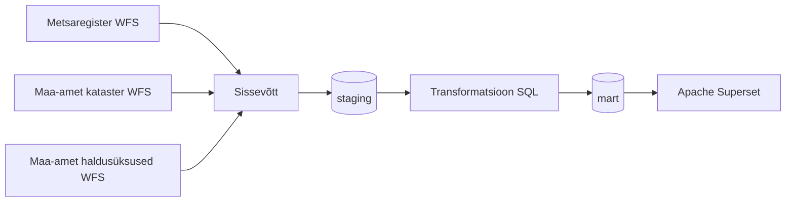

# Metsateatiste andmetoru

## Äriküsimus

Projekt kogub ja analüüsib Eesti metsaregistri raieteatisi, et võimaldada omavalitsuste, aastate ja raieliikide lõikes metsanduslike mõõdikute jälgimist. Projektis on liidetud nii kehtivad metsateatised ehk viimase 2 aasta teatised kui ka arhiveeritud metsateatised alates aastast 2018. Lahendus on kasulik metsanduspoliitika kujundajatele, uurijatele ja omavalitsustele, kes soovivad ülevaadet oma piirkonna raieaktiivsusest.

**Mõõdikud:**

1. Raieteatiste arv omavalitsuse, aasta ja raieliigi kaupa
2. Raiutud kogupindala (ha) omavalitsuse ja aasta kaupa
3. Raiutav kogumaht (m³) omavalitsuse ja aasta kaupa

## Arhitektuur



Täpsem kirjeldus: [`docs/arhitektuur.md`](docs/arhitektuur.md)

## Andmestik

| Allikas | Tüüp | Ajas muutuv? | Roll |
|---------|------|--------------|------|
| Metsaregister WFS (`metsaregister:teatis`) | WFS API | Jah, igapäevane täislaadimine | Kehtivad raieteatised |
| Metsaregister WFS (`metsaregister:teatis_arhiiv`) | WFS API | Jah, inkrementaalne laadimine | Ajaloolised raieteatised |
| Maa- ja Ruumiamet kataster WFS (`kataster:ky_kehtiv`) | WFS API | Harva muutuv, täislaadimine | KOV nime lisamine katastritunnuse kaudu |
| Maa- ja Ruumiamet haldusüksused WFS (`ehak:omavalitsuste_piirid`) | WFS API | Harva muutuv | KOV piiripolügoonid kaardikihi jaoks |
| `scripts/raieliik_koodid.csv` | Seed-fail | Staatiline | Raieliigi koodide tõlketabel |

## Stack

| Komponent | Tööriist |
|-----------|---------|
| Sissevõtt | Python (`requests`, psycopg2) |
| Transformatsioon | SQL (plain SQL failid) |
| Andmehoidla | PostgreSQL 16 + PostGIS |
| Näidikulaud | Apache Superset |
| Orkestreerimine | cron (`scripts/start_cron.sh`) |

## Käivitamine

```bash
# 1. Klooni repo ja liigu kausta
git clone <repo-url>
cd metsateatiste-andmetoru

# 2. Kopeeri keskkonnamuutujad ja sea paroolid
cp .env.example .env


# 3. Käivita andmebaas ja pipeline
docker compose up db pipeline -d --build

# 4. Lae andmed sisse (esimesel korral)
docker compose exec pipeline python scripts/run_pipeline.py ingest
docker compose exec pipeline python scripts/run_pipeline.py ingest-kov
docker compose exec pipeline python scripts/run_pipeline.py ingest-kataster

# 5. Käivita transformatsioon
docker compose exec pipeline python scripts/run_pipeline.py transform

# 6. [Vabatahtlik] Lae arhiiv (845k kirjet, võtab kaua)
docker compose exec pipeline python scripts/run_pipeline.py ingest-arhiiv
```

Superset näidikulaud: http://localhost:8088

### Pipeline käsud

| Käsk | Kirjeldus |
|------|-----------|
| `run-all` | Igapäevane töövoog: ingest + ingest-kov + ingest-kataster + transform + test |
| `ingest` | Kehtivad raieteatised Metsaregistrist |
| `ingest-kov` | KOV piirid Maa-ameti WFS-ist |
| `ingest-kataster` | Katastritüksuste KOV-viited Maa-ameti WFS-ist |
| `ingest-arhiiv` | Arhiveeritud teatised (backfill + inkrementaalne) |
| `transform` | Loob staging ja mart tabelid SQL-failidest |
| `test` | Käivitab andmekvaliteedi testid |
| `check` | Näitab tabelite kirjete arvu ja viimased käivitused |
| `reset` | Tühjendab kõik staging tabelid |

```bash
docker compose exec pipeline python scripts/run_pipeline.py <käsk>
```

### Apache Superset

Superset käivitatakse koos andmebaasiga (Superset vajab `db` teenust käivitamisel):

```bash
docker compose up db superset -d --build
```

Ehitamine võtab esimesel korral mõni minut. Superset avaneb aadressil **http://localhost:8088**.

Sisselogimise andmed on `.env` failis: `SUPERSET_ADMIN_USER` ja `SUPERSET_ADMIN_PASSWORD`.

**1. samm — andmebaasi ühenduse seadistamine**

Seda tuleb teha üks kord pärast esmakordset käivitamist:

1. Logi Supersetti sisse
2. Ava **Settings → Database Connections**
3. Klõpsa **+ Database → PostgreSQL**
4. Sisesta SQLAlchemy URI:
   ```
   postgresql+psycopg2://metsaregister:POSTGRES_PASSWORD@db:5432/metsaregister
   ```
   Asenda `POSTGRES_PASSWORD` oma `.env` faili `POSTGRES_PASSWORD` väärtusega
5. Klõpsa **Test Connection** — peab ilmuma roheline `Connection looks good!`
6. Klõpsa **Connect**

**2. samm — näidikulaua importimine**

1. Ava **Settings → Import Dashboards**
2. Lae üles fail `superset/dashboard_export_*.zip`
3. Klõpsa **Import**

**3. samm — veendu, et andmed on olemas**

Kui dashboard näitab tühja vaadet, käivita pipeline enne Superseti avamist:

```bash
docker compose exec pipeline python scripts/run_pipeline.py run-all
docker compose exec pipeline python scripts/run_pipeline.py transform
```

## Saladused ja konfiguratsioon

Kõik saladused on `.env` failis. Repos on ainult `.env.example`. Päris `.env` faili ei tohi GitHubi panna — see on `.gitignore`-s.

| Muutuja | Tähendus |
|---------|----------|
| `POSTGRES_USER` | PostgreSQL kasutajanimi |
| `POSTGRES_PASSWORD` | PostgreSQL parool |
| `POSTGRES_DB` | Andmebaasi nimi |
| `DB_PORT_HOST` | PostgreSQL port hostis (vaikimisi 55432) |
| `WFS_BASE_URL` | Metsaregistri WFS baas-URL |
| `MAA_WFS_BASE_URL` | Maa-ameti WFS baas-URL |
| `SUPERSET_SECRET_KEY` | Superseti krüpteerimisvõti (genereeri: `python -c "import secrets; print(secrets.token_hex(32))"`) |
| `SUPERSET_ADMIN_USER` | Superseti admini kasutajanimi |
| `SUPERSET_ADMIN_PASSWORD` | Superseti admini parool |
| `SUPERSET_ADMIN_EMAIL` | Superseti admini e-post |
| `SUPERSET_DB_USER` | Superseti metaandmebaasi kasutaja |
| `SUPERSET_DB_PASSWORD` | Superseti metaandmebaasi parool |
| `SUPERSET_DB_NAME` | Superseti metaandmebaasi nimi |

## Andmevoog lühidalt

1. **Sissevõtt** — Python skript pärib WFS API-delt kehtivad raieteatised, KOV piirid ja katastritüksuste andmed ning laadib need `staging` kihti
2. **Laadimine** — Toorandmed salvestatakse `staging.raw_*` tabelitesse; kehtivad teatised upsert-itakse `sys_id` järgi, kataster ja KOV piirid laaditakse täismahus üle
3. **Transformatsioon** — SQL-skriptid loovad `staging.v_metsateatis_kov` (kehtivad teatised koos KOV nimega katastritunnuse kaudu) ja `staging.v_metsateatis_kov_arhiiv` (arhiiv sama loogikaga); `mart.mart_raie_kov_kaart` koondab näitajad omavalitsuse, aasta ja raieliigi kaupa
4. **Testimine** — 28 andmekvaliteedi testi kontrollivad toorandmete korrektsust ja mart-tabeli olemasolu
5. **Näidikulaud** — Superset dashboard näitab raienäitajaid omavalitsuste ja aastate lõikes; Streamlit pakub alternatiivset vaadet

## Andmekvaliteedi testid
Projekt kontrollib 26 testi abil kõiki staging ja mart tabeleid (scripts/02_quality_tests.sql).
Testitud tabelid:

Testitud tabelid:

- `staging.raw_metsateatis` — 11 testi (sys_id, pindala, maht, otsus, geomeetria, duplikaadid, kehtivusaeg)
- `staging.raw_metsateatis_arhiiv` — 3 testi (sys_id, pindala, duplikaadid)
- `staging.raw_kataster` — 4 testi (tühjus, tunnus, unikaalsus, ov_nimi)
- `staging.raw_kov_piirid` — 4 testi (arv, nimi, geomeetria)
- `mart.mart_raie_kov_kaart` — 4 testi (tühjus, pindala, teatiste arv, geojson)
- KOV liitmise kaotus — 2 testi (kehtivad ja arhiiv)

Lävendid:
| Probleem | Warning | Failed |
|----------|---------|--------|
| Vigane geomeetria | < 1% | ≥ 1% |
| NULL väärtused | < 5% | ≥ 5% |
| Duplikaadid | < 0.1% | ≥ 0.1% |
| KOV liitmise kaotus (kehtivad) | < 5% | ≥ 5% |
| KOV liitmise kaotus (arhiiv) | < 10% | ≥ 10% |
| Tühi tabel | — | alati failed |


Stop/go reegel:

- `failed` — pipeline peatub, andmed ei jätka töötlemist
- `warning` — pipeline jätkab, probleem logitakse
- `passed` — kõik korras

**Duplikaatide automaatne puhastus:** duplikaadid logitakse `quality.duplicate_log` tabelisse ja kustutatakse automaatselt enne testide käivitamist.

Testide tulemused salvestatakse `quality.test_results` tabelisse ja on nähtavad Superseti dashboardil.

```bash
docker compose exec pipeline python scripts/run_pipeline.py test
```

## Projekti struktuur

```
.
├── README.md
├── compose.yml
├── .env.example
├── .gitignore
├── Dockerfile.app
├── Dockerfile.superset
├── docs/
│   ├── arhitektuur.md
│   └── progress.md
├── init/
│   └── 01_create_objects.sql    ← skeemid ja tabelid (käivitub automaatselt)
├── scripts/
│   ├── run_pipeline.py          ← pipeline käivitamise peaskript
│   ├── 00_seed_dimensions.sql   ← raieliigi koodide seeding
│   ├── 01_transform.sql         ← staging ja mart tabelite loomine
│   ├── 02_quality_tests.sql     ← andmekvaliteedi testid
│   └── raieliik_koodid.csv      ← raieliikide lähteandmed
├── superset/
│   ├── superset_config.py       ← Superseti konfiguratsioon
│   └── dashboard_export_*.zip   ← eksporditud dashboard
└── dashboard/
    └── app.py                   ← Streamlit dashboard (ei kasutata)
```

## Kokkuvõte, puudused ja võimalikud edasiarendused

**Kokkuvõte:**
- töötav andmetoru kolmest WFS-allikast: Metsaregister (kehtivad teatised + arhiiv ~845k kirjet), Maa-ameti kataster (~700k katastritüksust) ja haldusüksuste piirid
- Staging kiht toorandmetega, transformatsioonikiht KOV-nime lisamisega katastritunnuse kaudu ning mart-tabel, mis ühendab kehtivad metsateatised ja arhiveeritud metsateatised, agregeeritud raienäitajatega
- Kolm mõõdikut: teatiste arv, kogupindala (ha) ja kogumaht (m³) — omavalitsuse, aasta ja raieliigi lõikes
Superset dashboard koropletkaardiga, mis visualiseerib raieaktiivsust KOV-ide kaupa koos GeoJSON piiripolügoonidega
- 28 andmekvaliteedi testi staging-kihi korrektsuse kontrollimiseks
- Igapäevane automatiseeritud andmevoog cron-i kaudu

**Puudused:**

- Ligikaudu 7% arhiiviteatistest ei saa KOV-i nime juurde, sest nende katastritunnus on vahepeal muutunud
- Superseti seadistus nõuab uuel kasutajal käsitsi andmebaasi ühenduse loomist; automatiseerimiskatsed jäid versioonide ühildumatuse tõttu poolikuks
- Deck.gl koropletkaart ei rendereeri kõiki KOV-e usaldusväärselt kõigil kasutajatel
- Registriandmete puudused: kehtivate metsateatiste andmestikus on hulk mittekehtivaid metsateatisi, mis peaksid olema liikunud arhiivi, aga ei ole - need on meie mõõdikutest välja jäetud
  
**Mis edasi:**

- Lisada ajalise trendi mart-tabel aastatevahelise muutuse näitamiseks
- Muuta mart-tabel inkrementaalseks — ajaloolisi aastaid ei ehitataks iga päev nullist üles
- Uurida Superseti alternatiivi (nt Streamlit koos Folium-iga), mis toetab paremini ruumilisi visualisatsioone
- Lisada katastritunnuste historiseerimine, et vähendada arhiivis KOV-nimeta jäävate teatiste arvu
  
## Meeskond

| Nimi | Roll |
|------|------|
| Anni-Brit | Andmeallika omanik — sissevõtu loogika, orkestratsioon (CRON) |
| Kati | Transformatsioonide omanik — staging ja mart mudelid, mõõdikute arvutamine |
| Tiina | Kvaliteedi omanik — testid ja ebaõnnestunud kontrollide läbivaatus |
| Maris | Näidikulaua omanik — dashboard ja seos äriküsimusega |
