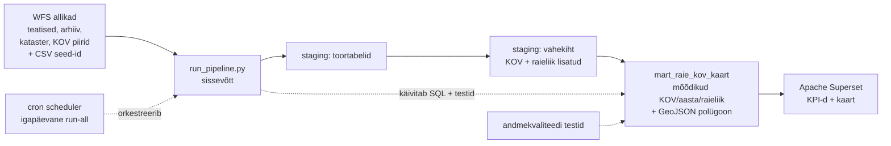

# Arhitektuur

## Äriküsimus

Kuidas on metsaraie (metsateatiste alusel) Eestis aastate jooksul muutunud — kus, kui palju ja mis tüüpi raie kasvab või kahaneb?

## Mõõdikud

Kõik mõõdikud on kohaliku omavalitsuse (KOV) kaupa.

1. **Raieala (ha) ja raiemaht (tm)** — kehtivate metsateatiste pindala ja raiemahu summa.
2. **Raieliikide jaotus (%)** — iga raieliigi (lageraie, harvendusraie, sanitaarraie jne) osakaal KOV-i kogu raiealast.
3. **Raieala muutus (%) võrreldes eelmise aastaga** — jooksva ja eelmise aasta raieala vahe protsentides, kasutades nii kehtivaid kui arhiveeritud teatiseid.

## Andmeallikad
 
| Allikas | Tüüp | Ajas muutuv? | Roll |
|---------|------|--------------|------|
| Metsaregistri WFS — kehtivad teatised (`metsaregister:teatis`) | API (WFS) | Jah, uueneb tööpäeviti | Põhiandmed: raieala, raiemaht, raieliik, katastritunnus, geomeetria. ~146 000 kehtivat teatist. Igapäevane päring, upsert `sys_id` järgi. |
| Metsaregistri WFS — teatiste arhiiv (`metsaregister:teatis_arhiiv`) | API (WFS) | Jah, lisandub igapäevaselt | Ajaloolised andmed. ~840 000 kirjet. Ühekordne backfill + igapäevased inkrementaalsed lisandused (`arhiveerimise_aeg` järgi). Vajalik aastase trendi jaoks. |
| Maa-ameti WFS — KOV piirid (`ehak:omavalitsuste_piirid`) | API (WFS) | Ei, uueneb harva | 78 KOV-i piiripolügooni kaardi joonistamiseks. Truncate + insert iga laadimisega. |
| Maa-ameti WFS — katastriüksused (`kataster:ky_kehtiv`) | API (WFS) | Jah, uueneb regulaarselt | ~777 000 katastriüksuse tunnus → KOV nime ja maakonna vastendus. Kasutatakse teatise KOV-i tuvastamiseks. Truncate + insert, ilma geomeetriata. |
| `raieliik_koodid.csv` (seed → `dim_raieliik`) | seed / dim-tabel | Ei, staatiline | Raieliigi koodi (`too_kood`) ja inimloetava nime vastendus. |
| Maakonna ISO-koodid (seed → `dim_maakond_iso`) | seed / dim-tabel | Ei, staatiline | Maakonna nime ja ISO-koodi vastendus kaardi jaoks. |
 
**KOV-i tuvastamine.** Teatis ei sisalda otse KOV-i nime. Selle asemel ühendatakse teatise `katastri_nr` katastritabeli `raw_kataster.tunnus` väljaga, mis annab `ov_nimi` (KOV) ja `mk_nimi` (maakond). KOV piiripolügoon (`raw_kov_piirid`) lisatakse seejärel KOV nime (`onimi`) järgi. Ruumilist ristamist ega EHAK-koodi parsimist ei kasutata.
 
## Andmevoog
 

 
Orkestratsioon: cron (`scheduler` konteiner, `start_cron.sh`), igapäevane `run-all`.
Transformatsioonid: SQL-failid (`00_seed_dimensions.sql`, `01_transform.sql`), käivitab `run_pipeline.py`.
Andmekvaliteet: `02_quality_tests.sql`, tulemused `quality.test_results` tabelisse.
 
## Andmebaasi kihid
 
| Kiht | Tabel | Roll |
|------|-------|------|
| `staging` (toor) | `raw_metsateatis` | Kehtivad teatised WFS-ist, igapäevane upsert `sys_id` järgi. `_loaded_at` ajatempel. |
| `staging` (toor) | `raw_metsateatis_arhiiv` | Arhiveeritud teatised, backfill + inkrementaalne lisandus. |
| `staging` (toor) | `raw_kov_piirid` | 78 KOV-i piiripolügooni (Maa-ameti WFS), truncate + insert. |
| `staging` (toor) | `raw_kataster` | ~777k katastriüksuse tunnus → KOV/maakond, ilma geomeetriata. |
| `staging` (dim) | `dim_raieliik`, `dim_maakond_iso` | Seed-tabelid: raieliigi nimi ja maakonna ISO-kood. |
| `staging` (vahekiht) | `v_metsateatis_kov` | Kehtivad teatised, millele on katastri kaudu lisatud KOV nimi + maakond ja raieliik dim-ist. |
| `staging` (vahekiht) | `v_metsateatis_kov_arhiiv` | Sama loogika arhiivikirjetele. |
| `mart` (äriloogika) | `mart_raie_kov_kaart` | Mõõdikud (teatiste arv, kogupindala, kogumaht) KOV/aasta/raieliik lõikes, ühendatud KOV-i GeoJSON-polügooniga (EPSG:4326, lihtsustatud) koropletkaardi jaoks. |
| `quality` | `test_results` | Andmekvaliteedi testide tulemused (test, staatus, vigaste ridade arv, sõnum). |
 
## Tööjaotus
 
| Roll | Vastutus | Täitja |
|------|----------|--------|
| Andmeallika omanik / orkestratsioon | Sissevõtuloogika (`run_pipeline.py`), cron-scheduler, Docker Compose, staging skeem, logimine ja korduskatsed | Anni-Brit |
| Transformatsioonide omanik | SQL transformatsioonid (`00_seed_dimensions.sql`, `01_transform.sql`), vahekiht ja mart, mõõdikute arvutus | Kati |
| Kvaliteedi omanik | Andmekvaliteedi testid (`02_quality_tests.sql`) | Tiina |
| Näidikulaua omanik | Apache Superset KPI-paneelid ja koropleetkaart | Maris |

## Riskid

(1. sprindi seisuga)

| Risk | Mõju | Maandus |
|------|------|---------|
| Arhiivi backfill (~845k kirjet) ebaõnnestub — WFS timeout või katkestus | Ajaline trend (mõõdik #3) jääb puudu | Tõmbame batchitena kuu kaupa, logime progressi, katkestuse korral jätkame sealt, kus pooleli jäi. |
| Metsateatise raieala ulatub mitme KOV-i territooriumile | Raieala läheb topelt kirja | Uurime selliste kirjete hulka. Vajadusel jagame raieala KOV-ide vahel kattumise pindala järgi. |
| Interaktiivse kaardirakenduse tegemine osutub keeruliseks | Dashboard jääb poolikuks | Alustame lihtsamast versioonist, konsulteerime juhendajatega. |
| WFS API väljade nimed või struktuur muutuvad | Sissevõtt katkeb | Automaattestid ja valideerimisloogika kontrollivad oodatud väljade olemasolu enne laadimist. |
| KOV piirid muutuvad ajas | Ajaloolised andmed ei ole otseselt võrreldavad praeguste KOV-idega| Kasutame alati kehtivaid KOV piire ja teeme spatial join'i teatise geomeetria alusel, mitte KOV koodi järgi. Varasemad andmed koonduvad automaatselt praeguse KOV-i alla. |

## Privaatsus ja turve

Kõik kasutatud andmed on avalikud.

Andmebaasi paroolid ja konfiguratsioon tulevad `.env` failist, mis on `.gitignore`-s. Repos on `.env.example` malliga, mis ainult näitab vajalikke muutujaid. WFS API-d ei nõua autentimist.

