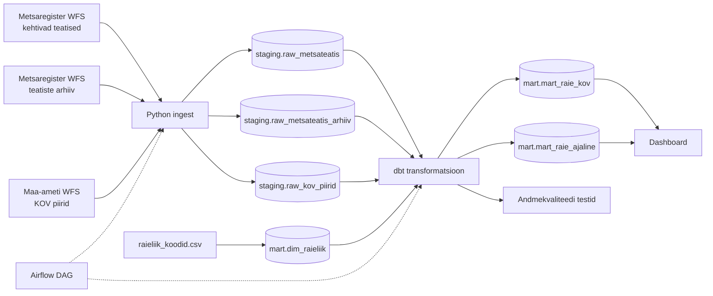

# Arhitektuur

## Äriküsimus

Kuidas on metsaraie (metsateatiste alusel) Eestis aastate jooksul muutunud — kus, kui palju ja mis tüüpi raie kasvab või kahaneb?

## Mõõdikud

Kõik mõõdikud on kohaliku omavalitsuse (KOV) kaupa.

1. **Raieala (ha) ja raiemaht (tm)** — kehtivate metsateatiste pindala ja raiemahu summa.
2. **Raieliikide jaotus (%)** — iga raieliigi (lageraie, harvendusraie, sanitaarraie jne) osakaal KOV-i kogu raiealast.
3. **Raieala muutus (%) võrreldes eelmise aastaga** — jooksva ja eelmise aasta raieala vahe protsentides, kasutades nii kehtivaid kui arhiveeritud teatiseid.

## Andmeallikad

| Allikas | Tüüp | Ajas muutuv? | Roll |
|---------|------|--------------|------|
| Metsaregistri WFS — kehtivad teatised (`metsaregister:teatis`) | API (WFS) | Jah, uueneb tööpäeviti | Põhiandmed: raieala, raiemaht, raieliik, geomeetria. ~144 000 kirjet. |
| Metsaregistri WFS — teatiste arhiiv (`metsaregister:teatis_arhiiv`) | API (WFS) | Jah, lisandub igapäevaselt | Ajaloolised andmed alates 2016. ~845 000 kirjet. Vajalik aastase muutuse arvutamiseks. |
| Maa-ameti KOV piirid (`ms:omavalitsus_pind`) | API (WFS) | Ei, uueneb harva | 78 KOV-i piiripolügooni kaardi ja ruumilise ristamise jaoks. |
| `raieliik_koodid.csv` | seed / dim-tabel | Ei, staatiline | Raieliigi koodi ja nime vastendus. |

## Andmevoog

## Andmebaasi kihid

| Kiht | Roll |
|------|------|
| `staging` | Hoiab allikatest saadud andmeid töötlemata kujul: metsateatised, arhiiv, KOV piirid. |
| `mart` | Hoiab puhastatud ja transformeeritud tabeleid: mõõdikud KOV-i kaupa, ajaline trend, raieliigi dimensioon. |
| `quality` | Hoiab andmekvaliteedi testide tulemusi. |

## Tööjaotus

| Roll | Vastutus | Täitja |
|------|----------|--------|
| Andmeallika omanik | Kirjutab sissevõtu loogika, hoiab Airflow DAG-i töökorras, disainib staging kihi | Anni-Brit |
| Transformatsioonide omanik | Kirjutab dbt staging ja mart mudelid, arvutab mõõdikud | Kati |
| Kvaliteedi omanik | Kirjutab dbt testid ja vaatab läbi ebaõnnestunud kontrollid | Tiina |
| Näidikulaua omanik | Ehitab näidikulaua ja seob selle äriküsimusega | Maris |

## Riskid

| Risk | Mõju | Maandus |
|------|------|---------|
| Arhiivi backfill (~845k kirjet) ebaõnnestub — WFS timeout või katkestus | Ajaline trend (mõõdik #3) jääb puudu | Tõmbame batchitena kuu kaupa, logime progressi, katkestuse korral jätkame sealt, kus pooleli jäi. |
| Metsateatise raieala ulatub mitme KOV-i territooriumile | Raieala läheb topelt kirja | Uurime selliste kirjete hulka. Vajadusel jagame raieala KOV-ide vahel kattumise pindala järgi. |
| Interaktiivse kaardirakenduse tegemine osutub keeruliseks | Dashboard jääb poolikuks | Alustame lihtsamast versioonist, konsulteerime juhendajatega. |
| WFS API väljade nimed või struktuur muutuvad | Sissevõtt katkeb | Automaattestid ja valideerimisloogika kontrollivad oodatud väljade olemasolu enne laadimist. |
| KOV piirid muutuvad ajas | Ajaloolised andmed ei ole otseselt võrreldavad praeguste KOV-idega| Kasutame alati kehtivaid KOV piire ja teeme spatial join'i teatise geomeetria alusel, mitte KOV koodi järgi. Varasemad andmed koonduvad automaatselt praeguse KOV-i alla. |

## Privaatsus ja turve

Kõik kasutatud andmed on avalikud.

Andmebaasi paroolid ja konfiguratsioon tulevad `.env` failist, mis on `.gitignore`-s. Repos on `.env.example` malliga, mis ainult näitab vajalikke muutujaid. WFS API-d ei nõua autentimist.

